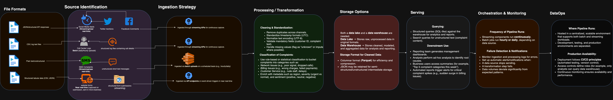

## Conceptual Data Pipeline

You can view the full diagram here:  
[View Pipeline Diagram](https://viewer.diagrams.net/index.html?tags=%7B%7D&lightbox=1&highlight=0000ff&edit=_blank&layers=1&nav=1&title=conceptual_pipeline.drawio#R%3Cmxfile%3E%3Cdiagram%20id%3D%22conceptual%22%20name%3D%22Conceptual%20Data%20Pipeline%22%3E7T3ZduK4tt9yH1ir6gGWB2zgMSGhu%2B6qqs7pdJ%2B%2B9ylL2AJ0Yiy3bGforz%2BabDzI4BAPkJDqTkAWRt57a897a2DOty%2B%2FEBBsfmAXegNDc18G5s3AMGxd1%2BkfNvIqRsamaYqRNUGuGNN3A%2FfoHygHNTkaIxeGuYkRxl6Egvygg30fOlFuDBCCn%2FPTVtjLf2sA1rA0cO8Arzz6F3KjjRg1TU3bXfgVovVGfrVhWfLKFiSz5UC4AS5%2BzgyZtwNzTjCOxKvtyxx6DHwJYMTnFhVX05UR6Ed1PhDimDgUlvxjT8CL5SPK1UWvyTMTHPsuZJ%2FSB%2Bb18wZF8D4ADrv6TNFMxzbR1pOXV8jz5tjDhH%2FWvNVvrNsJHQ8jgh9h5oo9n95e07Vdl9ctH%2BUJkgi%2BZIbkc%2FwC8RZG5JVOkVeH4wTKCV3Jt887HFnJ2CaDHmsmB4Gki3V67x3k6AsJPDUgn%2BEqHjpXQ2fy4P82cX7923DuhtNZCY7QpaQk32ISbfAa%2B8C73Y1e7yCt0Xe7Od8xDiR8%2FwOj6FXuCxBHOA99CkLy%2Bn%2Fy8%2FzN%2F7M3Iyt5e%2FOSvXjzKt%2BJtbIFVhKTHBJUI4aQv4ZhhLAvNyIgayhnBwRT2grpDDXiCPRAhJ7yX%2FceJBTW0hY9LxYLYz5vm571WZ6cp2VyHs9U5Ky1Rc6z8ccn5zzN5uk5jDBhoqEbYi6uJEfNtkfXdL30sPP4d4wjmMOKzYbo5S1dO%2FIH5hW9qmX%2BH2vBCweQtsTEhUTM8LEPxWgAXJd9rfignJvclL5ay798DS56Un45pfJoCDy0lgvw4Crae6MVpmhR3YldGIacPNiNdPvAipbKuyyB87jmxDh0xIZlN0M%2BihDwlPebexD4HPwUaDbYMqYgftOR%2Bwj4LiAu%2BgcIhiO%2BmyJ1WVxPGAD%2F3UvSHA%2BEYe7joa6AAbtFuhTxzfnV0GEB6dIwx2RLyI294oiHWoFTwzT1O9ziJ7a73DjwkAMipitpwCE4ZC%2BcDaAqpheODkO3AhdlMJwHYHb0z6AToS0VvGxzMHWaUDWXQefLn3%2FMv34%2B0PxkAPAkYOhGYVLId7ArWAkFymI4%2FYRg%2BTeFiQu4qNoy2qHClMnNFYKey6nFiamA3VJxZGjf6P3n3ILbBh5A%2FJsZKD8h2H6lsPI40JBUBoQmwEG28sBaqBlURt0aA6ojzuax%2F%2BjjZz95T79TwwyoaBvEHPzPG0jY34AyMbT0YKNQpYNlZq%2BWLkxYZjSY%2FMVAMbs09nGVj4MkyU2WYShsFna3gMCqO1HLZFaNzjnTLNCKSTeuyWh4RX%2FNk60XZtHV4I7RaiDpovXshWBd4vwzZNudxB4cLkFIjTHJEajIjhA1mB3gJbDO0gG1xKiJEDuPMMry4pAvg19kCtEaE8S5URg7G2nz1EBHHX6M2gbMTxg9Y%2FLIJE4Ycp6arq8XRDGeDkfrkZB%2BARZYogTHEMSGXIKDgCOQ4swLc5z7lAF9jTxPCK9TBPQzwXxtVJ2n1n4oBlcAeRzSAXjdQkr2ZwPs%2BU6RuofkCTnwtMBNYlc4LMBqJckaeuC1MQB38US3PkGc3T2jiP3ZwghQnRbk%2BCDzCq05L2UPGcInSFDElN4vMaUzrnE8sVk%2Btxi%2BimlU3%2BOTfWZU8TlfqKKGuG%2BJT%2FBhHJGEIfhwzd1OX1vW1RRDtTS04N36kEIHCIyDCpNCcdjzoWqgXR6owwdSqXZHPdDhSUUqbzA8cGPdTm%2FGg5bDAxM7Hx6YKMIDlio8oLcWHph%2B%2FPBAJgRQiA0wQdtZoCu3jLcHBioNGS0XMqCiL%2F%2B70cBBbZN7cuBGXfrXrzGX9kzMH%2BBMy3cvSdxPKhUeeMxqccs%2BgZAqKd2D4Zluzw2Ow5OCBXem%2BRBSPlZDg63wQ1R7ws5hMzepcpf3%2Bxt1hZQgbgTRfD%2Bwdypw1e4zpeTD%2FbT2YMZY%2BT3l69yXQsCz0O9jX8aBuSkqdwHiXjqCKHa550aGXGoQ34XKWqOyv%2BqwphMkNYeFuRl1MXLbsmy95I1k8us1YUZmlgBX3DEFKPW9hihMpxIYUA2OovNdlNiY%2B%2FVY2fMGkMovIqoHPGRynOHTivQHfxnKLIijh%2B4TBVZbcN6V0tQ8oUZNbKt2Qg%2FNMYM6rm4F1k9L%2BT3P8EfJ7Ym9eOsDkgpE%2BuJLe4z3%2FYLjDpC%2FYxZb6VJeFFf1Nd16cLVCDoK%2B85oydBbzISwJDfv9%2B2aLK%2F%2Ff%2B99%2Bcv2DrXfJI1wwAkhwD%2FFIIdyiYRiR2IliwsYXsZ99y%2BJYkGyhi4DUezhbOupZ3xb4foNxcPGzfpQH2jepyfzk6fy2g%2FzkNCM58UBaZQ%2BkofBAjlvLt599gnz7jKMx74HExNlAinGQJMB34YfMLkbhhzx2E2suCgOPMnZ5xaNcnb74H7RlBgbwi3qHaqvvkcCNaV%2FH6tzF%2B%2F0rhuSVA%2FJEvFoH1VqlyVPh2movbauOhnmKqvZ9VgehOqDMoPly%2F6%2FvQw89smgutbupLhPyzMcNz9rb%2BRey9neEnKIBXscRVIGqOircSQIUAsKj7jtgChgV9D2Zj%2Fslm1jq0GVTjlsn%2B6A21N6gDJ4cM7rBzwxoEGzpxD9PyNV%2BBFM6V1v298STxmmWY2INfUhkAcKWbv01lOkhLgg3SwyIW2ffd2yjXXEXIU8ZDCBhZjnjVe5wg51BzoHI0wmRy7JeVlxVYSWwLMuNMrwTfK7rOKQqCa8BoQskoijEEQNhvN2ChKNL0%2FoFUH4j83fSRO0%2FMNOPrEE%2Bzz2XUxltOHSeIXxM87lPIE2qhGaqFG%2Bli1jKILZ4gtZrnoYGPCiGBDgcgtKk08yThwEVfRxqu1yxMHYpUfAXhPsLeexjmaYTIp5OeBxI3maxX0zzj%2FxAHZnmtzb7N2jbNJ8USuFVtcO6yjSftmWa60lV8ke2zUsmeN5CZ8EzHIQd2eaKxXxCC73yRu3r0QsCqTUi3Om8pOYOBVDC6Xdql5yzXl1tC31sH8AR5NSs24DaAkLxYYoT9qEoxyEx%2B4oDWOw11sWMbOTHOA69132E337A63gz%2FxR8Jv0S4DWIuJflP3h5HmS3odLZ4wyYcEsZ9U19Sb1LAH1ZEM5L7ZLSEa5MdEChffinjhHFJcHTmHCmpBDzxM0bGEFHVjwOSn0%2BfuIoLYk8a4l9rp6wH5heFPXru%2B5O0t2dbZGjeXi98zBAQjA5Qb%2FRPS%2BljZnWDYTPBDkZ%2F8jCz5MbK9X3GyunbdLhU%2BRZ%2FL7cuGGla269HMAeFk3tIT8U6UGCksII8q4llB80RS%2BVjO4IX7yA8RNLbeKuMRc%2BJbkqdMtyWvEjLuFWBDPnKnwJKDuThatRNrlIJRwahC4k%2FnEAfL8b7uKduzzQxylQbLRT4a3dfiaQYWh5d2Pq7Dvob7Qa8Ddm3Gqf0sXVlEr8l2wL9CncVB%2FEH9Wg%2FP4Vh5HMiR2I0j6H%2BcR5JzNXBuMc4IEl70YF%2FSdEsC9D0NGGZ1uHcZDE%2FpaiUHIpHQayqUHGf8X6rngY1Apan4LjpUFI38An6OFAwI7BNWJ2DYPKruqGmjZunJilGWDzSDPfpiGkTJvFXM8%2Bb6U1I%2F8uC8SrJ6rigyXyeAuO8%2BVp52rI38DAw6%2BSYayw57E%2B7KftPZx%2Fo6ua3%2FDtiHwHBR7cKw67cB9qX0Am2SLHOajGFgpaZ952gr1TzBRJsmTkEoVNuxLqBn1fmTWDfU%2FUpaQJRQ5fFEv4e915I9IsyRN89nkaAxmwSkvu1xLCEPphLKoxQY5LJcJApE4Bv5Zv%2BJLo8gEtz3NLdFlY7N%2BgbcvTnhUtT0URiqayPE2rrUwXXWGJFiAbPkKmF4tckwDzKrTbJ67eCWim54KwCSzBM02CyYA8D1pZU1%2FAg6Wxf4yzgSX07ngjMSoizBum3LNy%2FGsGbZaM970wgWrwVM5kJlwJ3eImYrk31ziOmJE4T89YYV8i1Y%2FdzelzBOyZty9rdhjMCLMaQzjiOZMj1sLwQUx9ALwfWkIUJQpQ0En1QSDmJE8Uhl4mClVrJLsBZ4SaJIzDJJFDshK4GcyX4Nw0dot4e4ZLD69xOAq3YZnIxtPrmVFBkU3g07ZHMzOHUlNxuIs9GxkKpI7bQqp5GKl8a%2FMvtq4H1g3DXBgIjK7QC0P3XqxWc4GSn8%2B%2B0rQqllBEJv2eJViCB8fDsTtyqTKJ%2FAeqaTxQLFMCgU1tQ9sYsUOR0p9xDoVju4zCyXiU8OVuNqZdwuEc8I%2FNBQ4M7TsPKxYbGGRMsROyV2R6Rt8GikyzWKTJF3HAPT2HelTWVTIPTyrqtoVtyauA9m%2B9IlvcItflKakqNSifptrE3hkbxkjLszxjVt4vujVNp2U3jEFZ4aStPTMp7Zn7H%2FeDfMfwXeOFpnw5mdy3hQ95lwc64A1Zl9R9JN9sq4QK%2Bj07%2BmK8WZ%2Fm%2BbFujqyyomQrFCWzNX48LdFWIpNEU4%2BzYcU%2F30Ci3XBlBwRJFaRIfIiX%2FEiJXXti7pnj3v8tcggecuc9bIZtf0SObCmUUH1mjiZ2h1smqdjotq5icFR9hPIBkhYR2UoJ5UQB1g4qJ%2FYuUxFgbq6FVzkSUmPkPY2wiktMd1t5kbk6amoMMo6MhL%2BW%2BXKp4JeJ6UKBdlkvHi88wDvUTshuz35hEG20gdZRD3V2DNEw7dEkb9KpWsAYqhYwrXHDsXnu3NCqyQ31CvTU5ob8o1eE8PZZyQTpsNjd%2BQ6L2twU62OrqDga41kWbzU%2FYxVwLVayw3z6SO9g2ZaCZZ%2Bhh8ZxHPHqIeMxbWgX61N7NLUyThojjyeq9UxLe9qiOk55U1tG4n9rXviW%2FTQlTJ6JAzV6RpG4c4FC9JsrfWGoKaQJdq1PiptQ4VCwFN63JnL01FgtexL%2BkNBhB6r4Mgn%2B%2FCSjVQK1bilMhU4l46SX3mhNSsZpXTvB6tVOKLswFpTelhg%2FCh%2BZzOI6O6rWtZpUPR5ZXRrAxuywbEi4MdqypsM5MKvZ90Guz%2BXFdWoiZPj4iv%2FQKfzLrhJtQlOpFnI9N5soCsSxeQv6n%2BP6%2BghRo2qFKA7JyGGFHQuR4LJg46xSKMQOtUOGvHfp0DCmlOgXFgs0LvhaoPuQkJ35ED6th7oxHQVpq753UcKkliRRHk3fEg2YRg0ayMbcs%2FusiJQqDW2n6BUkt3k9vVlU09LxqkVRiVg7gTESiH%2FgiH8QrsVm%2FMF7YnWKw4XsyWhWxvCkNQyXo633HBB07AcDBXNHQOiGg7JDuPdYxNcqz8DZCQFzaoxmNYSApozFt2f26yVYdtpcZjSdzga5BjO2ORnsbzHD391BQmmGo%2FYdfWf22kwH9SXBPPvSl8ZlTt0t6sZTPY863Rr3jbpZV6g7zgk0KQUPJQ%2BodAGZxmz%2FR9rxAI3HCr2gdad9W7FIcctCR9NwQ8l%2FkHY23cIwBPwMW3WctHk%2F%2FCfxdlOat%2FO%2BsbSiMevtnnTq7S7bmiXQnoODM9yGD5yOHyT5PoTy3OKmnJzjIvcxrVkJeeNZ4uvM16iO7JbwN%2B1F9jUoqMZ1BdVk2quOoXIR9BRy3RtWlQ1yd6kZh%2BKn7Yqahk%2FP4b03EjJj0WfOuoch491sngeCEIqp7NQZygIEAxDHNa2oxeXJYuwfdIBeJ0AWUIb0xkM6gFaZD2RKEPVALcMzBaldpeIcyqY5exNRn5XiwpZCUur2rFs%2FoaVK4ChAN%2FEP7hORCoFaxAAjP8l%2BdRbRSdx8aLvm9VlL%2Bhv8Q%2Fc8eyTR15suf7HAngvJw18i420UPq2bQomljbTsTz6PaWxPlJl%2FCmFo2fkbtcWxrd4NesvMW4WWlc7oySpMCPhwaoDZp7C1%2Bjbop1Yec%2Fb0ULfftjE3rhu60nt1xVg1ouzv60azMGp1o3kft5sWagIVrG2sTxiZlNmb3pr0UYQFkbc7ALMyIniwyE8OZcG%2BEz%2FGOHkvb6wKU6QKQkmQNYKO8XhkGrPdTw45itI8XVmv2Rpiqm2DjVmZ3n2fNL37Jo6skC37DmR5l294lJvk7EmCRxEmGZKweyYCW6UbHiSCb5mGlPes0TpcH%2Boue6EA4SbTCwpp7wRQo2i7X%2BOABzkfmMxo0DCYmsYo4cAJQ1ZwZNscJa6qXLB3mpoNzacr9WwA5FVIo53zItSkaNRUFs1e1fxkmQqW2fgZv4uck%2Bzq7ht%2FyjDAfggPeci6C0TQFaF%2FeHu0TF%2BHPC%2BgBBfKrf8GLt7ETp9Y5Z1ull3g%2BqxTrlujhP5zcF3DOAmua6vipZ8SIaZ5GgipUcJwYgjJK5ZNYMewR0ahd8T4JLCTuLnPNn5n180Rene10ft2gcox1UUArDoC%2BKY8iiZ7yN3%2FW4S8RAWmzPqQhZitd9f4NNqSqY30QvsNczYy7IzPolwWpSzoaC3neXLupY72eXjFbVWSTQeJAXesl0q6xRf5tK9DO%2F2Nvch77nh%2F4T37eY853vXzyfKbcZf8xn5LEs3pkWCzx%2FBlTpQHy9jjJQCyA%2B2XVEQz50UXPa8%2Bzc7YG0lS2QTK5gOt1ahMyrZZt5FvzShUIfQd%2BE54xomnLExUVnYHIl4EkAQb2dBPrtlRCQcYRq9drbIHOFzdfeu%2FGbo8Tz7bWFv2uTrUKPvCUzmDLBwUrhtln7BpdmrWVNv6ne%2FFN5VQXDZmdnk5yB2zSz%2FpBlRlKyk3YGtBmUm5K0f1BmxqpJ2N%2FMTLgk953ybnI8kOuX1vW9EZkp%2Fq6WygG3scjEsQIt7TFY7YqZ7MtEla%2By54r993GjmfZaub%2Ba1uKmJ%2Bpir%2BqreWlTjpybd1VntU5BtA303qYvveo0yYQnZaxNAl1DbiTkKC1mtIwoFs4LqnK8Flg1Zu0HF%2Bg46T3qqHNmhryvD0pLKgJlrfPQ2Seu7D9YaTPv0J0xp5LeW2MxX9aXJFtzzhPswn3B%2FZoa6QnG9MJ9Ztuf1ctqFRfq9esxROKsHmrNkF%2B8O2L1UO2AWdDxuF0ZlylN%2BiOHNWceMJ%2F%2FRoNlPcRC%2BMsU5cubmcvRQrkR%2FjJSQ%2BJdeQt1xiENgNcZBKPATkm8PhCgLUALMx9TyzqdlCKSklaZ5ma6T%2BXGj2QrM5YzW5RW9EWyM96kK0F6I9FCfqlmhrlNkp%2B9fmCPRIYixp6tnz5IpNOp5DcyQ8FIrz%2FaaWOabjdKqL6M1aUMcLdXymroyCTxW4m7amkFcbzMpCoeO68hfaFxjjihOU7whmp6kKty97MEP7g%2FVY4IeFXurR6hLatHheoKqhXZcu2ITwa1HZe45%2FqEto9xEmLBvY0H4LohptSU6WtrSuaUs37QIX6524qoPdPbCwe9boKdd%2F5cKoqolpUuBUiiKFjompOlrbAzH9Rth5VawSVxTlpnFI8XvAGwelp25fKK6GDmYaBe25d%2FZVHZ7sgeJuQAR%2BCw7FBC7EJIjJnnZGTPQtwQxV6bVfmE3zA7vMzrz9Lw%3D%3D%3C%2Fdiagram%3E%3C%2Fmxfile%3E#%7B%22pageId%22%3A%22conceptual%22%7D)

## Conceptual End-to-End Data Pipeline for Beejan Technologies

The purpose of the pipeline is to systematically convert disorganized customer grievances into actionable intelligence for the decision-makers. The objective is to capture every possible data interaction within the company to streamline data for the entire firm.

Data Sources: I focused on four main types of data—social media, call center logs, SMS complaints, and web forms. It is a mix of structured and unstructured data, and that is the reason the design incorporates extensibility.

Ingestion: Streaming and batch ingestion both apply in this scenario. Call center logs are best handled in batches (daily/hourly), while social media and SMS are more time-sensitive and require real-time streaming. The same is true for website forms, but we can view them as micro-batches or nearly real-time.

Processing/Transformation: To ensure data functionality, it necessitates removing duplicates, fixing format discrepancies, aligning timestamps and encodings, and sorting complaints into categories like network, billing, or customer service.

Storage: I opted for a dual-layer strategy: a data lake for holding all information in its original state and a data warehouse for the processed and organized data. This allows analysts to refer back to the original data if necessary, while reporting teams receive quick, prepared datasets. Columnar storage formats are optimal for efficiency.

Serving: The processed data will be accessible via a query layer that facilitates dashboards, automated reports, and on-demand queries. This assists various teams—from executives needing summaries to analysts seeking trends.

Orchestration & Monitoring: Scheduled batch jobs will execute at specific times, whereas streaming jobs operate continuously. Failures will be identified via monitoring systems that analyze logs, volumes, and rates of errors. Notifications will guarantee the team reacts swiftly.

DataOps: To maintain the reliability of the pipeline, it will operate in a scalable production setting with a distinct division between development, testing, and operational systems. Modifications will be managed with version control, verified through testing, and deployed via automated systems.

**Assumptions & Thought Process**

While designing this pipeline, I made a few assumptions:
1.	Social media platforms and SMS providers allow access via APIs.
2.	All sources can be aligned into a common schema (with fields like complaint type, customer ID, and timestamp).
3.	Management wants both real-time insights (e.g., sudden spikes in complaints) and historical analysis (e.g., complaint trends by region over a year).
4.	The pipeline should prioritize simplicity at first but remain flexible to scale in the future.
My thought process was to start broad by collect everything in raw form and gradually refine by cleaning and enriching the data until it is valuable enough for decision-making.

**Challenges & Unknowns**
There are a few open questions and risks that would need clarification before building this in real life:
•	Data integrity: social media and SMS are chaotic. Identifying sarcasm, slang, or abbreviations may impact the accuracy of classification.
•	APIs and access: There may be limitations on the use of social media data, and integrating SMS might incur additional charges or constraints.
•	Categorization of complaints: Establishing precise categories will necessitate input from business stakeholders. Lack of alignment can result in classifications that do not meet managers' expectations.
•	Latency needs: It is unclear if the management requires actual real-time dashboards (seconds) or if “near real-time” (minutes) is sufficient. This may alter design priorities.

**In conclusion**, the focus is on creating a process that integrates isolated data, refines it, and presents it in an organized, usable format. The integration of a data lake and a warehouse provides both adaptability and efficiency. Incorporating monitoring and DataOps practices emphasizes that this pipeline is practical and intended to be sustainable in a production environment.
This pipeline offers Beejan Technologies a unified source of truth for customer complaints, converting frustration into valuable insights. With time, it may develop further, such as by integrating sophisticated machine learning for sentiment analysis or predictive analytics for customer retention.
